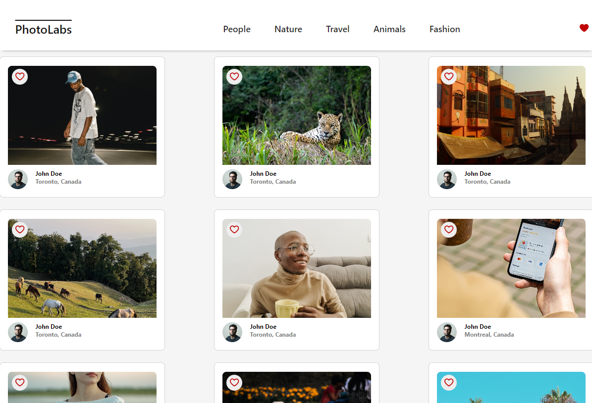
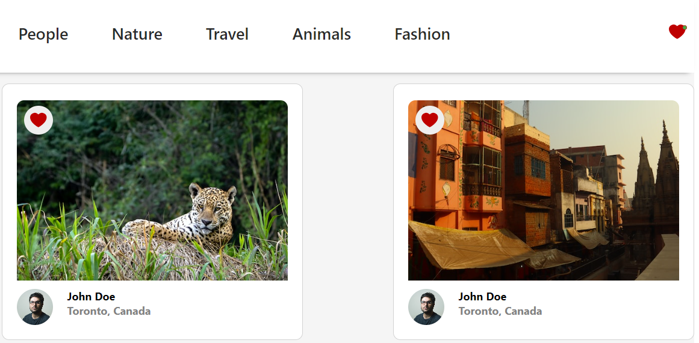
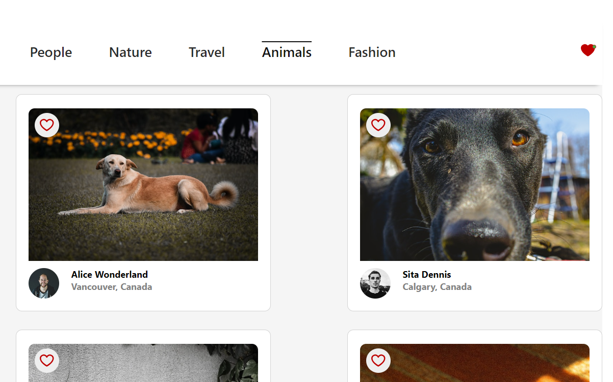
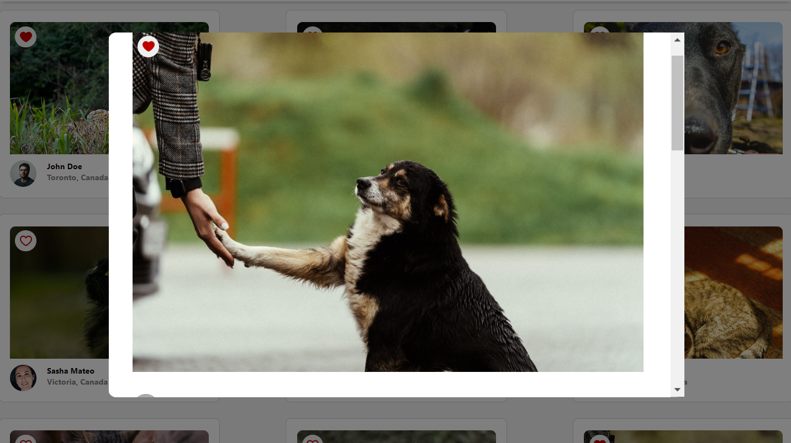
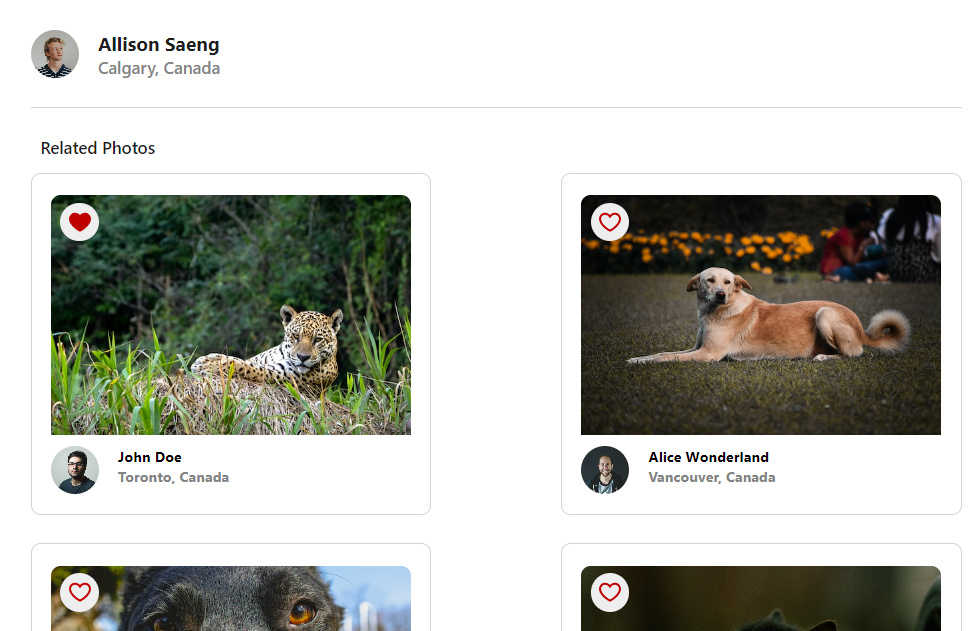

# Photolabs - A React Project

## Overview
PhotoLabs is a React-based single page application designed to provide users with a seamless experience in exploring, viewing, and interacting with a vast collection of photos. This application leverages a PostgreSQL database, a Node Express.js server to ensure efficient data management and retrieval, and Axios to handle http requests

## Preview
Users can access a diverse range of photos directly from the homepage, sourced from the API



A heart icon with a notification feature is integrated into the navigation, signaling users when they have liked photos

Users like a photo from any section of the application where the photo is displayed



Navigation is facilitated through the ability to explore various photo topic categories



Clicking on a photo allows users to view an enlarged version in a pop up modal



The modal also displays a brief summary of the user who posted the photo along with a selection of similar photos



## Setup

Clone the repository and install dependencies with `npm install` in each respective `/frontend` and `/backend`

## [Frontend] Running Webpack Development Server

```sh
cd frontend
npm start
```

## [Backend] Running Backend Server

Read `backend/readme` for further setup details.

```sh
cd backend
npm start
```
## Dependencies 
    axios: 1.7.2,
    body-parser: 1.18.3,
    cors: 2.8.5,
    dotenv: 7.0.0,
    express: 4.16.4,
    helmet: 3.18.0,
    pg: 8.5.0,
    socket.io: 2.2.0,
    ws: 7.0.0
    react: 18.2.0,
    react-dom: 18.2.0,
    react-scripts: 5.0.1,
    web-vitals: 2.1.4

## Known Issues
1) In the backend package.json file, there is a proxy set to http://localhost:8001/, however it does not work for the Axios http requests. So, the full URL is used in the requests instead

2) The functionality of the modal opening and closing onClick of a specific photo is dependant on the currentSelectedPhoto state, when ideally the modal should have it's own state 
